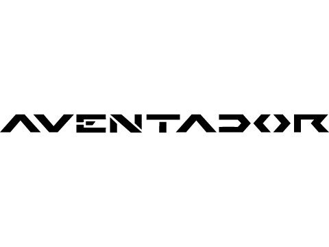
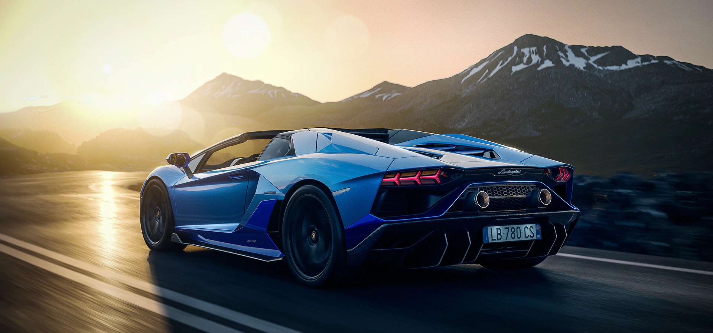

<!DOCTYPE html>
<html>

<head>
    <link rel="shortcut icon" type="image/png" href="favicon2.png">
    <title>Automobile</title>

    

</head>

<body>
    
    <h1>Lamborghini</h1>
    <!-- Name : Dharmin Lad
         Email: dlad3073@conestogac.on.ca
    -->

    

        <nav>
            <ul class="navigation" class="li1">
                <li><a href="welcome.html" class="option">Home</a></li>
                <li><a href="#" class="option">Portfolio</a></li>
                <li><a href="#" class="option">About</a></li>
                <li><a href="#" class="option">Contact</a></li>
            </ul>
        </nav>
    

    

        <h2>Aventador Models </h2> <small></small>  
        <ul class="listing">
            <a href= "https://www.youtube.com/watch?v=viW44cUfxCE">AVENTADOR SVJ</a>
            <a href="https://www.youtube.com/watch?v=C74Hq3HVD0Y">LP 780-4 ULTIMAE</a>
            <a href="https://www.youtube.com/watch?v=1gu1noIun8U">ULTIMAE ROADSTER</a>

        </ul>
        
    

    

        <h3>AVENTADOR</h3>
        
        
Automobili Lamborghini S.p.A. is an Italian brand and manufacturer of luxury sports cars and
            SUVs based in
            Sant'Agata Bolognese. The company is owned by the Volkswagen Group through its subsidiary Audi.
            Revolutionary thinking is at the heart of every idea from Automobili Lamborghini. Whether it is
            aerospace-inspired design or technologies applied to the naturally aspirated V12 engine or carbon-fiber
            structure, going beyond accepted limits is part of our philosophy. The Aventador advances every concept of
            performance, immediately establishing itself as the benchmark for the super sports car sector. Giving a
            glimpse of the future today, it comes from a family of supercars already considered legendary.

    

</body>

<footer>
    

    
Copyright &copy; HTML Entity Dharmin Lad - dlad3073@conestogac.on.ca - 2021

</footer>

</html>
